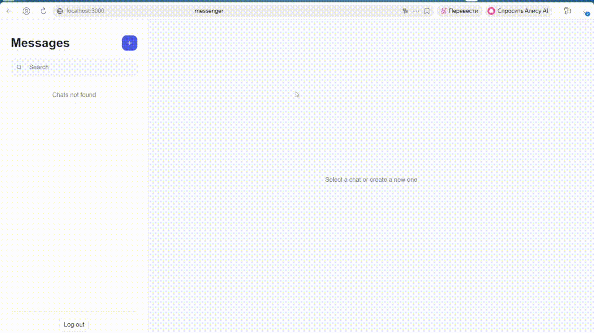

# Messenger

Full-stack мессенджер с личными и групповыми чатами, обменом сообщениями в реальном времени и управлением участниками.


## Демо

Добавление нового чата и его удаление


Создание новой группы и ее удаление


## Возможности

- Регистрация и JWT-авторизация
- Хеширование паролей через bcrypt
- Личные чаты один на один
- Групповые чаты с названием
- Отправка и получение сообщений через WebSocket
- Статусы отправки сообщений
- Автоматическое переподключение WebSocket
- Защита от повторной отправки сообщений
- История сообщений с пагинацией
- Поиск сообщений внутри чата
- Роли `owner`, `admin` и `member`
- Добавление и удаление участников
- Управление ролями
- Удаление чата владельцем
- Проверка доступа к чужим чатам
- Docker Compose и Nginx
- Автоматическое заполнение базы демонстрационными данными
- Интеграционное тестирование основных сценариев

## Стек

| Часть | Технологии |
|---|---|
| Frontend | React 19, TypeScript, Vite, React Router |
| Backend | Python 3.13, FastAPI, SQLAlchemy, Pydantic |
| Real-time | WebSocket |
| Авторизация | JWT, bcrypt |
| База данных | PostgreSQL 17 |
| Reverse proxy | Nginx |
| Инфраструктура | Docker, Docker Compose |
| Тестирование | pytest, HTTPX, websocket-client |

## Архитектура


Nginx является единой точкой входа:

- `/` — frontend
- `/api/*` — REST API
- `/ws/*` — WebSocket

## Запуск

### Требования

- Git
- Docker Desktop
- Docker Compose

### 1. Клонирование

```bash
git clone <repository-url>
cd messenger
```

### 2. Настройка окружения

Скопируйте `.env.example` в `.env`:

```bash
cp .env.example .env
```

Для PowerShell:

```powershell
Copy-Item .env.example .env
```

Замените `JWT_SECRET` на длинную случайную строку:

```env
JWT_SECRET=replace-with-a-long-random-secret
```

### 3. Запуск проекта

```bash
docker compose up --build -d --wait
```

После запуска доступны:

- Приложение: http://localhost:3000
- Swagger: http://localhost:3000/api/docs
- OpenAPI: http://localhost:3000/api/openapi.json

### Остановка

```bash
docker compose down
```

Удаление контейнеров вместе с базой данных:

```bash
docker compose down -v
```

> Команда `docker compose down -v` безвозвратно удаляет локальные данные PostgreSQL.

## Тестовые аккаунты

| Логин | Пароль |
|---|---|
| `alice` | `password123` |
| `alex` | `password123` |
| `sergey` | `password123` |

Seed-сервис также создаёт личный чат, групповой чат и тестовые сообщения. Повторный запуск seed не удаляет существующие данные.

## Docker-сервисы

| Сервис | Назначение |
|---|---|
| `db` | PostgreSQL |
| `seed` | Заполнение базы тестовыми данными |
| `backend` | FastAPI и WebSocket |
| `frontend` | React-приложение |
| `nginx` | Reverse proxy на порту `3000` |

Проверка контейнеров:

```bash
docker compose ps -a
```

Просмотр логов:

```bash
docker compose logs --no-color --tail=100
```

## API

Для защищённых endpoint требуется JWT:

```http
Authorization: Bearer <access_token>
```

### Авторизация

| Метод | Endpoint | Описание |
|---|---|---|
| `POST` | `/api/register` | Регистрация |
| `POST` | `/api/login` | Получение JWT |
| `GET` | `/api/me` | Текущий пользователь |
| `GET` | `/api/users` | Список пользователей |

### Чаты

| Метод | Endpoint | Описание |
|---|---|---|
| `GET` | `/api/chats` | Список чатов |
| `POST` | `/api/chats` | Создание чата |
| `DELETE` | `/api/chats/{chat_id}` | Удаление чата владельцем |

### Участники

| Метод | Endpoint | Описание |
|---|---|---|
| `GET` | `/api/chats/{chat_id}/members` | Список участников |
| `POST` | `/api/chats/{chat_id}/members?user_id={user_id}` | Добавление участника |
| `DELETE` | `/api/chats/{chat_id}/members/{user_id}` | Удаление участника |
| `PATCH` | `/api/chats/{chat_id}/members/{user_id}/role` | Изменение роли |

### Сообщения

| Метод | Endpoint | Описание |
|---|---|---|
| `GET` | `/api/chats/{chat_id}/messages` | История сообщений |
| `GET` | `/api/chats/{chat_id}/messages/search?q={text}` | Поиск сообщений |

История поддерживает параметры `cursor` и `limit`:

```json
{
  "items": [],
  "next_cursor": null,
  "has_more": false
}
```

## WebSocket

Подключение:

```text
ws://localhost:3000/ws/chats/{chat_id}?token={access_token}
```

Отправка сообщения:

```json
{
  "type": "message.send",
  "dedup_key": "8f14bdf2-4b18-45f1-b50e-1fc7cd9846de",
  "message": "Hello!"
}
```

Подтверждение отправителю:

```json
{
  "type": "message.ack",
  "duplicate": false,
  "message": {}
}
```

Событие для остальных участников:

```json
{
  "type": "message.created",
  "message": {}
}
```

`dedup_key` предотвращает повторное сохранение одного сообщения.

## Тестирование

Сначала запустите Docker-стек:

```bash
docker compose up --build -d --wait
```

Затем:

```bash
cd backend
python -m venv .venv
pip install -r requirements-dev.txt
pytest -q
```

На Windows:

```powershell
.\.venv\Scripts\Activate.ps1
pytest -q
```

Интеграционный тест проверяет:

- регистрацию и вход;
- JWT-доступ;
- личные и групповые чаты;
- роли и управление участниками;
- запрет доступа к чужим чатам;
- WebSocket ACK;
- дедупликацию сообщений;
- поиск;
- пагинацию;
- удаление чата.

## Структура проекта

```text
messenger/
├── backend/
│   ├── app/
│   │   ├── api/
│   │   ├── core/
│   │   ├── models/
│   │   └── schemas/
│   ├── scripts/
│   ├── tests/
│   └── Dockerfile
├── frontend/
│   ├── messenger/
│   └── Dockerfile
├── nginx/
│   ├── nginx.conf
│   └── Dockerfile
├── docker-compose.yml
└── README.md
```

## Безопасность

- Пароли хранятся в виде bcrypt-хешей
- JWT имеет ограниченный срок действия
- Доступ к сообщениям проверяется по членству в чате
- Управление участниками доступно владельцам и администраторам
- Изменение ролей и удаление чата доступно только владельцу
- Для публикации необходимо заменить стандартный `JWT_SECRET`
